

  

<h1 align="center">Langmin</h1>

<strong>Your language assistant for the whole Mac.</strong>

  Proofread, rewrite, explain, summarize, translate, or look a word up, from a shortcut in any app or from Langmin's own window. Drop a recording, a document, or a screenshot and work with its text. Ask a follow-up, edit the answer, hear it read aloud, and keep it in your Library. Private by design.

  <a href="https://min.tools/langmin">Website</a>&nbsp;&nbsp;|&nbsp;&nbsp;
  <a href="docs/user-guide.md">User guide</a>&nbsp;&nbsp;|&nbsp;&nbsp;
  <a href="https://min.tools/langmin/support/">Support</a>&nbsp;&nbsp;|&nbsp;&nbsp;
  <a href="PRIVACY.md">Privacy</a>&nbsp;&nbsp;|&nbsp;&nbsp;
  <a href="docs/development.md">Build</a>&nbsp;&nbsp;|&nbsp;&nbsp;
  <a href="docs/architecture.md">Architecture</a>

  
  
  
  
  
  
  

  <picture>
    <source media="(prefers-color-scheme: dark)" srcset="docs/images/hero-dark.png">
    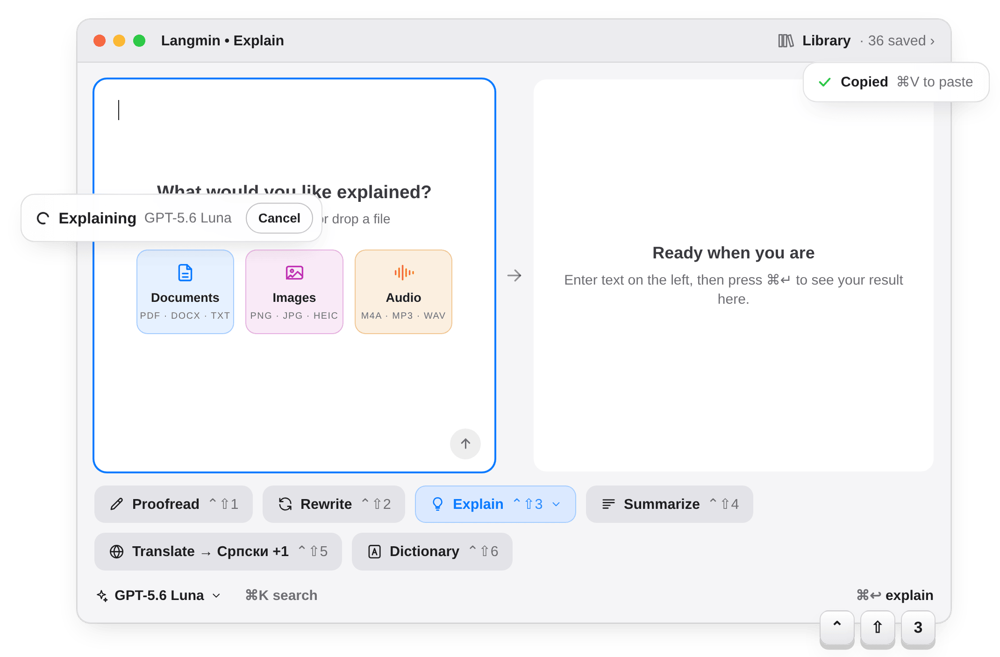
  </picture>

- **Six modes, one shortcut away**  
  Proofread, Rewrite, Explain, Summarize, Translate, and Dictionary. Press **⌃⇧1** to **⌃⇧6** from any app, or **⌘Return** in the window.
- **Any model, on your Mac or with your key**  
  Use Apple Intelligence on your Mac, or OpenAI, Anthropic, Google Gemini, xAI Grok, and DeepSeek with your own API key. You can also connect local models through LM Studio or Ollama.
- **Private by design**  
  Text goes straight from your Mac to the provider you chose, on your own account. No account with Langmin and no Langmin servers.
- **Results you can work with**  
  Follow up in a thread, edit the answer in place, hear it read aloud, print it, and save it to the Library.
- **Recordings, documents, and images into text**  
  Drop an M4A, MP3, or WAV file to transcribe it with Apple on your Mac, or with OpenAI in Pro. PDFs, Word files, and screenshots are read on device, with OCR.
- **Everywhere you write**  
  The menu bar, global shortcuts, the Services menu, drag and drop, pasted links, and a URL scheme.
- **Speaks thirty languages**  
  The app is localized in thirty languages, and Translate handles several target languages in one run.
- **Built for the keyboard**  
  **⌘K** finds any action, and every mode keeps its style and language options one key away.

## Get started

1. Open Langmin and choose a mode.
2. Type or paste text on the left, then press **⌘Return**.
3. Read the result on the right.

You can also drop or paste documents, images, and audio recordings into the input, or paste a link by itself into Explain or Summarize and Langmin reads the page first.

> [!NOTE]
> Langmin needs an Apple-silicon Mac running macOS 14 or later. On-device generation needs Apple Intelligence on macOS 26 or later. Cloud models need your own provider key and Langmin Pro, and the provider bills the usage.

## Six modes

| Mode | Shortcut | What it does |
| --- | --- | --- |
| **Proofread** | ⌃⇧1 | Fixes spelling, grammar, and punctuation and keeps your wording. Flip to Diff to see what changed. |
| **Rewrite** | ⌃⇧2 | Four styles: Rephrase, Humanize, Concise, and Elaborate. |
| **Explain** | ⌃⇧3 | Explains at the language level you choose, A to C. With web research on, the model can search and cite sources. |
| **Summarize** | ⌃⇧4 | Short, balanced, or detailed, for pasted text or a link. |
| **Translate** | ⌃⇧5 | Several target languages in one run, with recent targets one click away. |
| **Dictionary** | ⌃⇧6 | A rich entry by part of speech, with pronunciation, an optional picture, and a section in your own language. |

  <picture>
    <source media="(prefers-color-scheme: dark)" srcset="docs/images/modes-dark.png">
    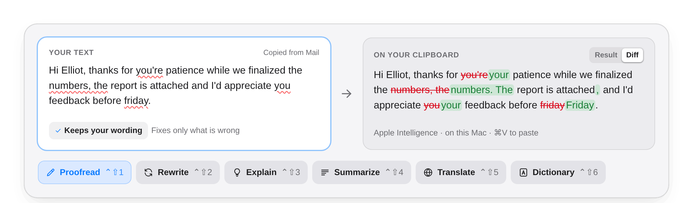
  </picture>

## Recordings, documents, and images

Drop an **M4A, MP3, or WAV** file into the input and the transcript lands as editable text, ready for any mode. Choose the speech provider in **Settings → Transcription**:

- **Apple** transcribes on your Mac, free, on macOS 26 or later. macOS fetches a speech model once, and the recording never leaves the machine. It does not even need Apple Intelligence.
- **OpenAI** sends the recording to GPT-Transcribe on your own account, with your permission. It detects the language, takes files up to 25 MB, and needs Pro and your API key.

Documents and images are read on your Mac, with OCR for screenshots and scanned PDFs. Only the text you approve goes to a model, never the file. Review imported text before running a writing mode.

  <picture>
    <source media="(prefers-color-scheme: dark)" srcset="docs/images/audio-dark.png">
    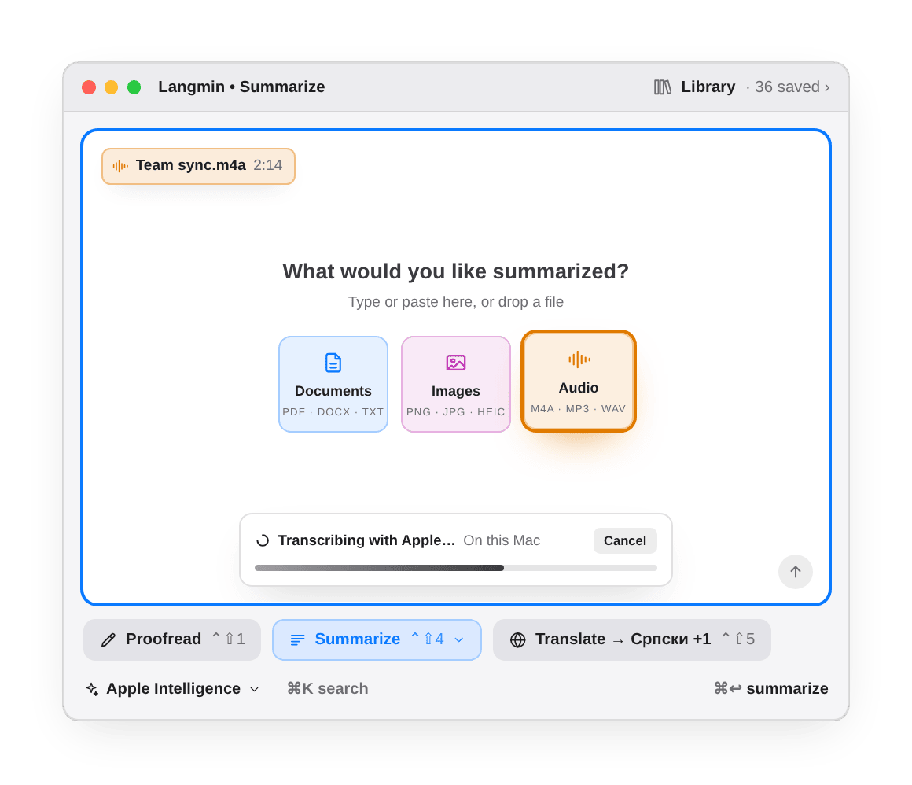
  </picture>

## Results you can work with

Every result is the start of a thread. Ask for an example, a shorter version, or another language, switch models halfway through, and every reply says which model wrote it. Edit the answer in place, have it read aloud with Apple, OpenAI, or Grok voices, print it, and save it to the Library with its follow-ups, edits, narration, and pictures.

<table>
  <tr>
    <td width="50%">
      <picture>
        <source media="(prefers-color-scheme: dark)" srcset="docs/images/followups-dark.png">
        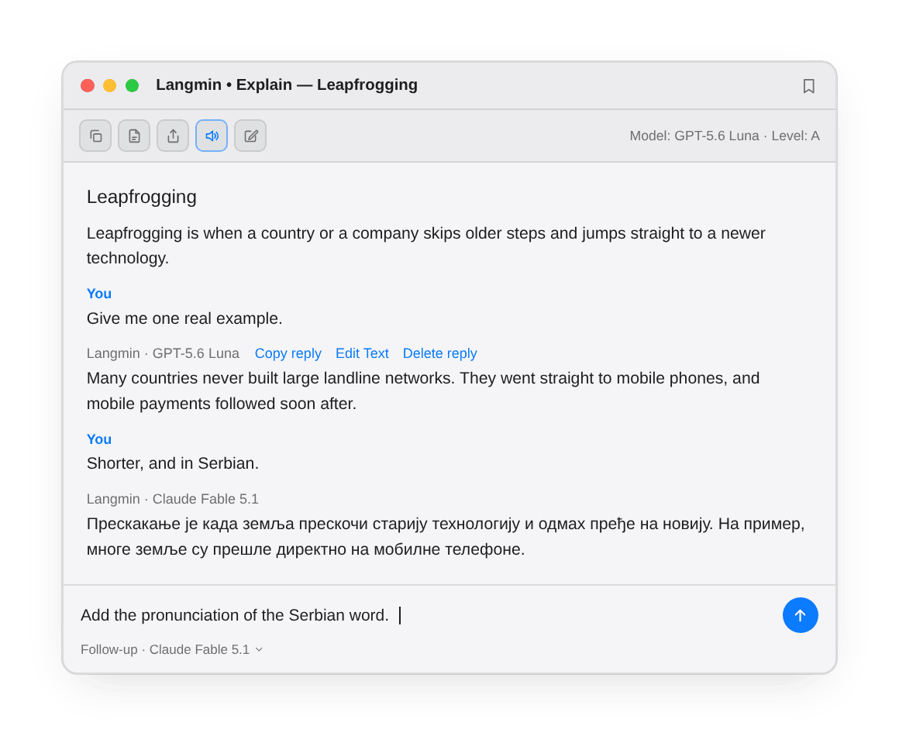
      </picture>
    </td>
    <td width="50%">
      <picture>
        <source media="(prefers-color-scheme: dark)" srcset="docs/images/dictionary-dark.png">
        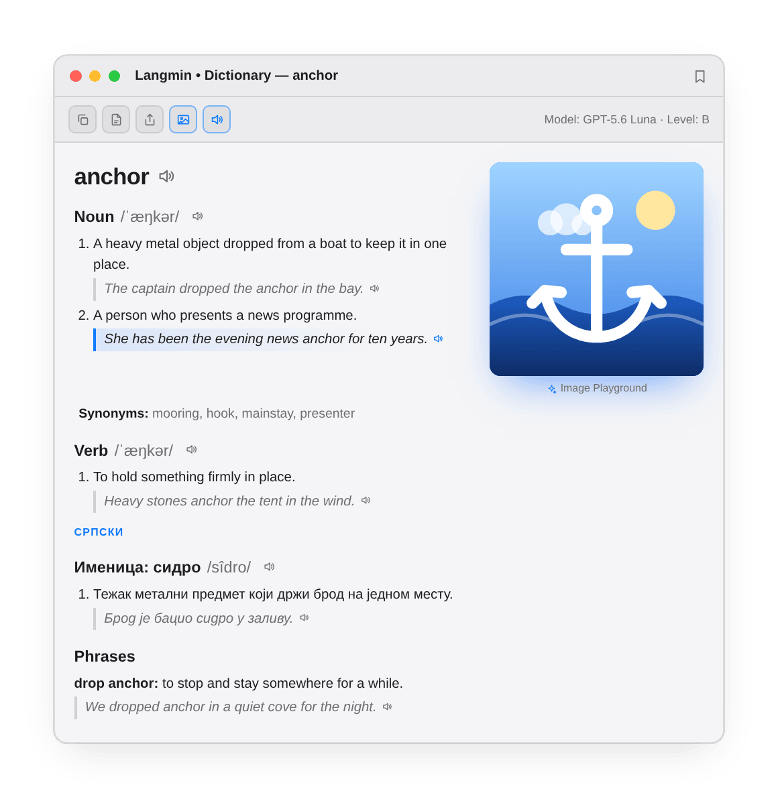
      </picture>
    </td>
  </tr>
  <tr>
    <td width="50%">
      <picture>
        <source media="(prefers-color-scheme: dark)" srcset="docs/images/voices-dark.png">
        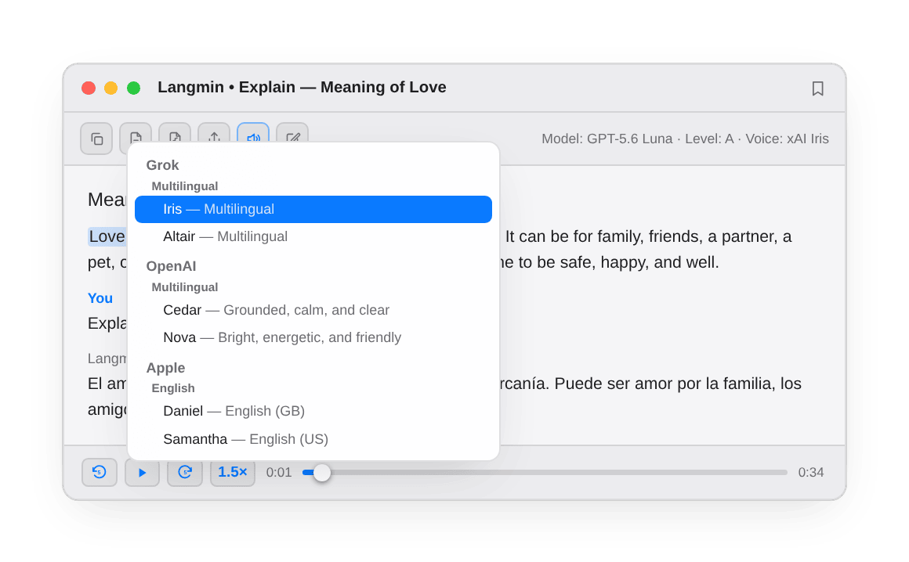
      </picture>
    </td>
    <td width="50%">
      <picture>
        <source media="(prefers-color-scheme: dark)" srcset="docs/images/library-dark.png">
        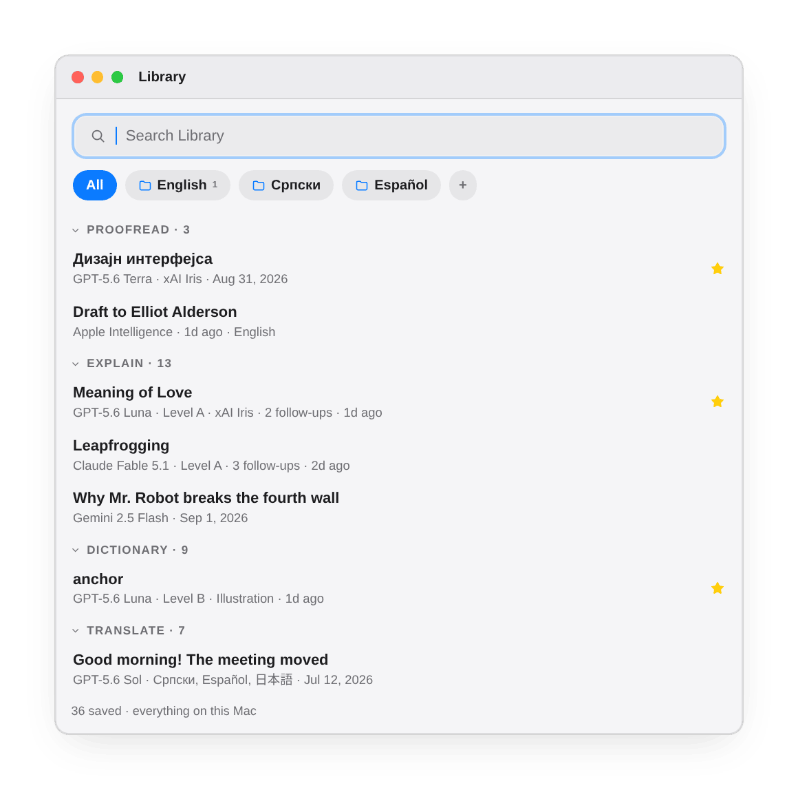
      </picture>
    </td>
  </tr>
</table>

  <picture>
    <source media="(prefers-color-scheme: dark)" srcset="docs/images/editor-dark.png">
    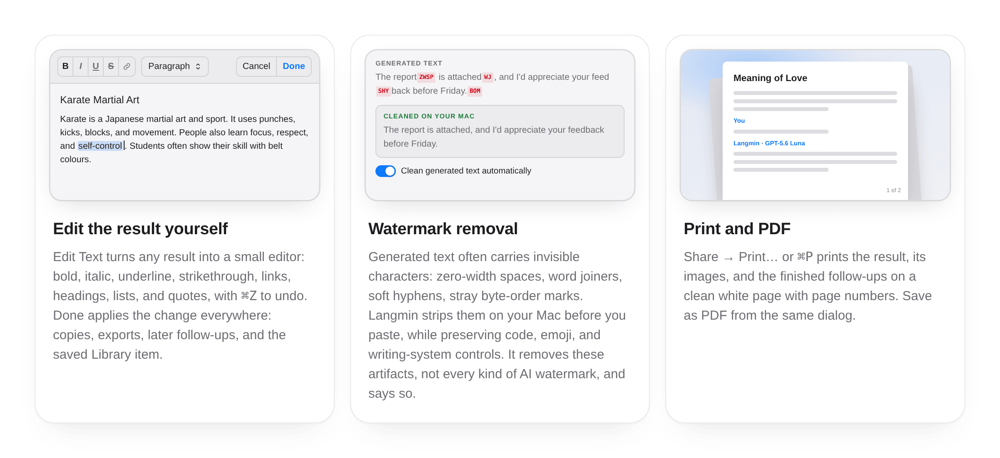
  </picture>

## Models

- **On your Mac**  
  Apple Intelligence for text, Apple voices for narration, Apple speech recognition for recordings, and Image Playground for pictures all run on the device.
- **With your own key**  
  Connect OpenAI, Anthropic, Google Gemini, xAI Grok, or DeepSeek. For custom servers, choose one that supports OpenAI chat completions, such as LM Studio or Ollama on your Mac, or a hosted service like Groq. Enter a key if the server requires one. OpenAI and Grok also offer narration; OpenAI handles pictures and transcription.

<table>
  <tr>
    <td width="60%">
      <picture>
        <source media="(prefers-color-scheme: dark)" srcset="docs/images/models-dark.png">
        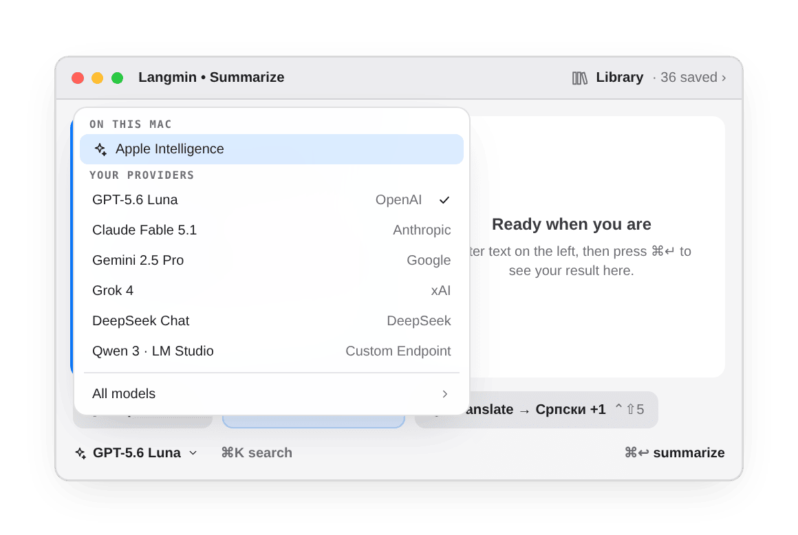
      </picture>
    </td>
    <td width="40%">
      <picture>
        <source media="(prefers-color-scheme: dark)" srcset="docs/images/privacy-dark.png">
        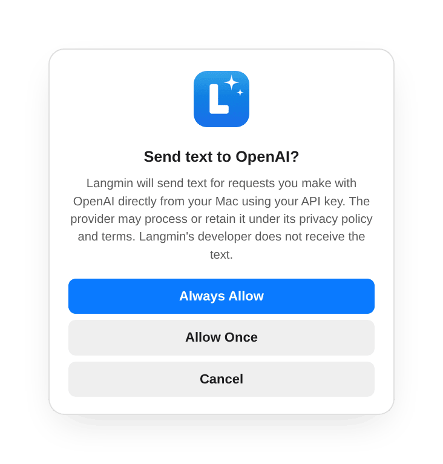
      </picture>
    </td>
  </tr>
</table>

> [!IMPORTANT]
> Keys live in the macOS Keychain and go only to their own provider. Langmin asks before the first time it sends text to each provider, and warns when the text looks like a password, a token, or an API key. Cloud providers need Langmin Pro; the provider bills the usage.

## From any app

Copy text and press the mode's shortcut: Proofread and Rewrite put the fix back on your clipboard, the other modes show the answer in a small panel. Or select text and pick Langmin from the app's **Services** menu, where Proofread and Rewrite replace the selection in place, with no Accessibility permission and no synthetic keystrokes.

<table>
  <tr>
    <td width="50%">
      <picture>
        <source media="(prefers-color-scheme: dark)" srcset="docs/images/services-dark.png">
        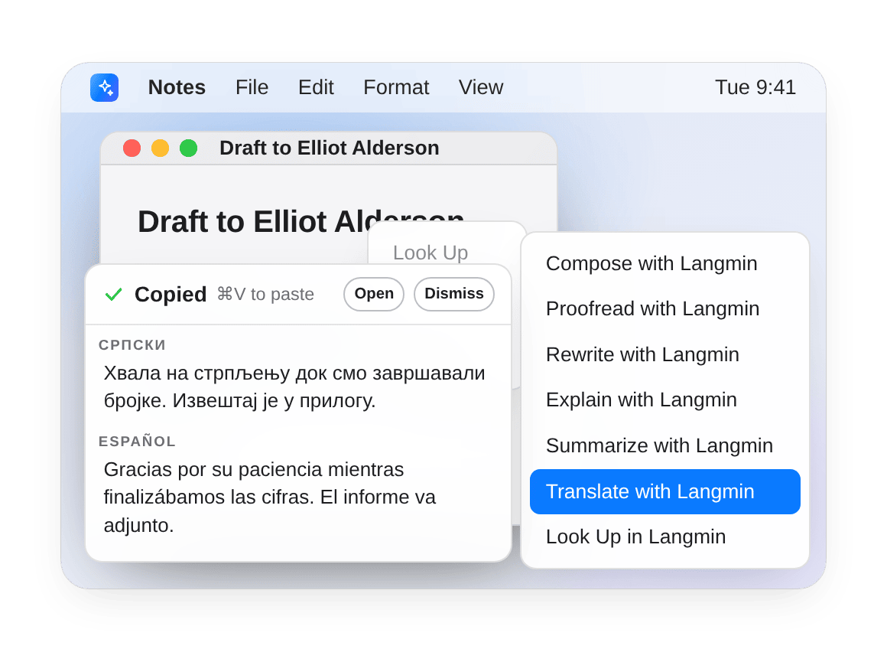
      </picture>
    </td>
    <td width="50%">
      <picture>
        <source media="(prefers-color-scheme: dark)" srcset="docs/images/keyboard-dark.png">
        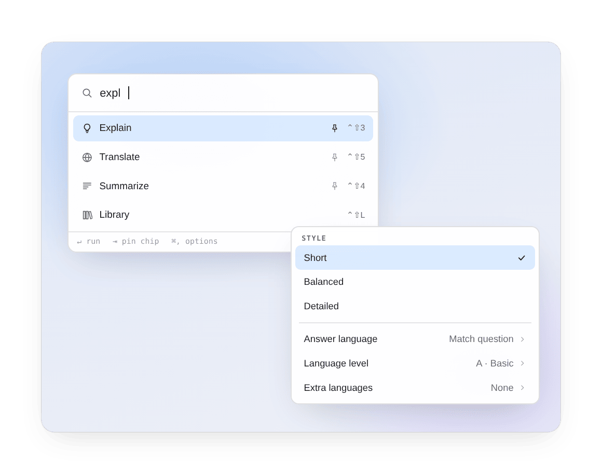
      </picture>
    </td>
  </tr>
</table>

> [!TIP]
> **⌘K** finds any action, **Tab** pins a mode as a chip, and **⌘,** opens the mode's options. The [user guide](docs/user-guide.md) has the details, including follow-ups, editing, the Library, iCloud sync, and printing.

## Works with

- **Text and research**  
  Apple Intelligence through Apple's Foundation Models framework, OpenAI GPT, Anthropic Claude, Google Gemini, xAI Grok, and DeepSeek. Custom chat servers include LM Studio, Ollama, and Groq. OpenAI, Anthropic, and Gemini support web research.
- **Audio and pictures**  
  Apple voices and speech recognition, Image Playground, and Grok voices. OpenAI provides GPT-4o Mini TTS for narration, GPT Image for pictures, and GPT-Transcribe for recordings.
- **macOS features**  
  Vision OCR reads text from images and scanned PDFs. The Services menu, global shortcuts, clipboard, and drag and drop bring content into Langmin. Keychain stores API keys, and optional iCloud sync shares your Library across your Macs. The URL scheme supports Shortcuts and other automation.

## One app, two ways to use it

**Mac App Store:** The free download starts with 30 days of full access. No subscription starts, and there is no charge. Afterward, Apple Intelligence, Apple voices, Apple transcription, text editing, and the local Library stay free. Pro adds cloud models and custom endpoints, web research, Library folders and iCloud sync, cloud voices, OpenAI images, and OpenAI transcription. Choose a yearly subscription or lifetime purchase at any time. Provider charges are separate.

**Build from source:** This repository contains the whole app. Public source builds use the same 30-day trial, free features, purchase checks, and post-trial banner as the App Store app. The Langmin banner can be dismissed because the included free features remain available. API keys, provider charges, OS requirements, and CloudKit signing requirements still apply. See [Build and test](docs/development.md).

If Langmin helps you, [contribute](CONTRIBUTING.md) to its development.

## Documentation

| Guide | What it covers |
| --- | --- |
| [User guide](docs/user-guide.md) | Modes, models, other apps, follow-ups, editing, Library and sync, printing, automation |
| [Build and test](docs/development.md) | Build requirements, source configuration, and tests |
| [Source architecture](docs/architecture.md) | App components, data flow, and source and Store builds |
| [Model prompts](docs/model-prompts.md) | What each mode asks the model for, and how custom instructions apply |
| [Privacy policy](PRIVACY.md) | What stays on your Mac, what goes to a provider, and your controls |
| [Third-party notices](langmin/Resources/THIRD_PARTY_NOTICES.md) | Licenses of the components Langmin includes |

## License

Copyright 2026 [Ilia Ross](https://github.com/iliaross). The source is available under the [PolyForm Strict License 1.0.0 with added permissions for personal modification and contributions](LICENSE). You may inspect, build, and run it for noncommercial purposes, modify it for your own personal, noncommercial use, and prepare a contribution to the official repository under the [contribution terms](CONTRIBUTING.md). The repository license does not otherwise permit distributing the source, modified copies, or binaries. The Min Tools name, the Langmin name, and the Langmin icon are not licensed. The Mac App Store build follows Apple's standard EULA and the [terms of use](https://min.tools/langmin/terms/).
